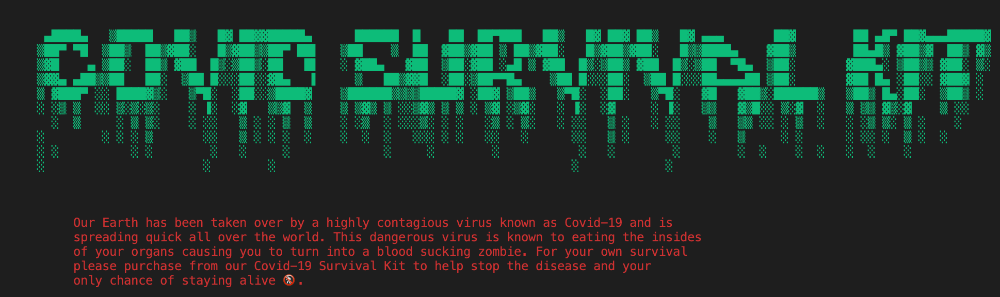

# Covid Survival Kit 
<br>

[Access the application here](https://github.com/Sajith14/covid_survival_kit) <br></br>

# Development and Scope

Originally the main idea for my application was to make a covid-19 related questionnaire/quiz and have the user select the correct answer and a total score will be printed at the end showing them their results. However after much thought I decided that the questionnaire/quiz would not be as interactive as I would like it to be which gave me the idea of doing a shopping list style application. The Covid Survival Kit is a simple terminal application that has been made through ruby. The idea of the application is to provide a fun and interactive way for the user to add items from a shopping list which will then be stored and printed with a total just before you decide to exit the app. The user will be able select various items from the shopping list and will also be required to enter the quantity of items they would like as well. Corona virus has been a tough time for a lot of people so the purpose of making this application is to make it somewhat fun for the user as they navigate through the application. The app is targed at everyone that is currently on lockdown and will provide them with some sort of entertainment while they have to quarantine themselves. Anyone from the target audience will be able to use the application through a link that will be provided to them.  

<br></br>

# Application Features

- User option 
- Menu list
- Total bill 
<br></br>

### User option 
As you start the app the user is introduced to the first feature which is the user option. The user is asked `What would you like to do?` followed by two options, `[F]ight back` or `[R]un away and cry` and to choose which option they would like to go with they will have to enter the letter *F* or *R*. However if the user is to enter another letter or number, `Invaild entry, start again` message will be printed to the screen and they will have to choose the correct option.  

### Menu list 
After the user selects the **fight back** option they will then have the menu list printed out to the screen. From here the user has several differnet items they can choose from and will then further be asked the quantity of items they would like. Each item has the letter they need to input to select the item and if any other letter is selected it will print out another invaild entry prompt and directed back to choosing a different option. The user is able to choose any quantity they like and that amount is added towards their total bill. 


### Total bill 

As the user navigates through the menu and adds items to their shopping list the data is stored away and they are able to see the current bill as they add more items. The user is able to `[C]ontinue shopping` or `[F]inish my order`. They can add as many different items as they like and a total amount will be added and printed on the screen. Once the total bill is calculatd the user is able to `[Quit]` the app. However if the user selects another letter or number it will take them back to the main menu page where they can decide to enter more items to the menu. 
<br></br>

# User interaction 

The main page of the app starts of with a welcome message as shown below. 



As you can see from the welcome message the app is trying to bring some light into the current situation with corona virus and allows the user to have a bit of fun as they move through the app. As you start the app spooky background music will start playing as you navigate through the app to create the feel as if a zombie apocalypse is about to happen. On the main page the user is able to choose from two options, they can either fight back or run away. If the user selects the fight back option it will then print out a list of items with the pricing list and the user is able to select whatever they like. If an invaild key is entered the user will be notifed and they will have to select an item again. The user also has the option to input the quantity of items they would like as well, however they will have to enter a valid number. If they select 0 they will be notified and will have to select another number. Once an item is selected it will then store the item with the total price and the user can continue to shop for other items as required. 


However if the user decides to go with the run away option they will be prompted with the following options and may quit the app if they wish to or will be redirected to the menu page.  


Once the user has gone through the menu and selected the items they require the total bill is printed out displaying the items they have ordered along with the quantity and price for each type of item. 


Once the user enters `q` or `quit` the app will then exit. 
<br></br>

# Flow chart 


<br></br>

# Implementation plan 

The implementation plan with the checklist along with the duration and deadline of tasks has been created on trello. 

[Access to trello board](https://trello.com/b/NTWJm2G9/covid-19-survival-kit) 
<br></br>

# Installation 

The Covid Surival Kit will require ruby to be installed in order to run the application. Follow these instructions on how to [download and install](https://www.ruby-lang.org/en/documentation/installation/). You can also choose to clone the repository straight from github. Link is provided below. <br>

https://github.com/Sajith14/covid_survival_kit

You will also have to open your terminal command line to install bundler and colorize in order to run the application and view all its features. There is also background music that is played throughout the navigation of the entire application so make sure your volume is turned up to get the full experience. However, a inbuilt music function from visual studio code was used to insert the music file and unfortunately only works with Mac systems. If you don't have the `bundler` gem installed on your computer then please open your command line terminal and follow the instructions below. <br>

```
 $ install bundler 
```

Once you install bundler you will have to install the colorize gem into your gemfiles. <br>

```
gem install colorize
```
Once you clone the repository make sure you're in the correct file location to run the ruby terminal application. <br>

```
ruby covid_spec.rb
```

 